# MNIST Multi-Model Experiments (PyTorch)

Approach : Model 1 is our Baselines → Model 2 where we perform BN/Dropout/GAP → Model 3 where we perform Augmentation+StepLR 

Objective : To reach ≥99.4% in ≤15 epochs with ≤8k params.

## Repository Structure

train.py — runner (CLI families, model summary, tqdm, plots, metrics, checkpoints)

model1.py — baselines: Big (~457k), Skeleton (~1.94k), Light (~8.7k)

model2.py — Light + BN / DO / BN+DO / BN+DO+GAP

model3.py — capacity, pooling fix, Depthwise convolution+ Aug+StepLR target

results/ — per-run CSVs, plots, confusion matrices, summary.csv

checkpoints/ — best weights per experiment

## Setup
pip install -r requirements.txt


If you have a CUDA GPU, use the matching Torch/TorchVision wheels (see requirements.txt notes).

##Usage
### run all
```bash
python train.py --epochs 15 --batch_size 128
```
### run only model families
```bash
python train.py --model1 --epochs 15
python train.py model2 --epochs 15
python train.py --model3 --epochs 15
```

### run specific experiments
```bash
python train.py --model2 --only m2_light_bn_do_gap --epochs 15
```

##Outputs

Metrics per run: results/metrics_<exp>.csv

Plots: results/plots/acc_<exp>.png, results/plots/loss_<exp>.png, results/plots/cm_<exp>.png

Best checkpoints: checkpoints/<exp>/best.pt

Consolidated: results/summary.csv

## Dataset & Normalization

MNIST (60k train / 10k test, 28×28 grayscale).
Normalization is computed on the training set only and applied to both train and test.


<!-- DATA_STATS -->
### Dataset & Runs Snapshot
- Below reflects **counts of runs** captured in `results/summary.csv`.

#### Runs per Model
| model | runs |
| --- | --- |
| model1 | 3 |
| model2 | 4 |
| model3 | 6 |

#### Runs per Model × Variant
| model | variant | runs |
| --- | --- | --- |
| model1 | big | 1 |
| model1 | light | 1 |
| model1 | skeleton | 1 |
| model2 | light_bn | 1 |
| model2 | light_bn_do | 1 |
| model2 | light_bn_do_gap | 1 |
| model2 | light_do | 1 |
| model3 | capacity | 1 |
| model3 | depthwiseConv_aug_steplr | 1 |
| model3 | poolfix | 1 |
| model3 | poolfix_aug | 1 |
| model3 | poolfix_aug_steplr | 1 |
| model3 | poolfix_steplr | 1 |
<!-- /DATA_STATS -->

##Experiments (Objectives → Variants → Results → Analysis)

###Model1 — Baselines

Objective: Establish reference points for capacity vs accuracy with one large and one compact CNN.

Variants

m1_big — deeper CNN (~457k params).

m1_light — compact CNN (~8.7k params).

m1_skeleton (~195.3k)

Auto-generated results and analysis

<!-- MODEL1_RESULTS -->
### model1 Results
| Variant | Params | Best Test Acc | Epochs |
| --- | --- | --- | --- |
| big | 457,066 | 99.26% | 15 |
| skeleton | 195,352 | 99.05% | 15 |
| light | 8,738 | 99.01% | 15 |

#### Per-Experiment Details
#### m1_big

**Target:**
- Get the set-up right
- Set Transforms / DataLoader
- Set basic Training & Test loop

**Results:**
- Parameters: 457,066
- Best Test Accuracy: 99.26%
- Epochs: 15

**Analysis:**
- Extremely heavy model for MNIST
- Over-fitting; will change model in next step

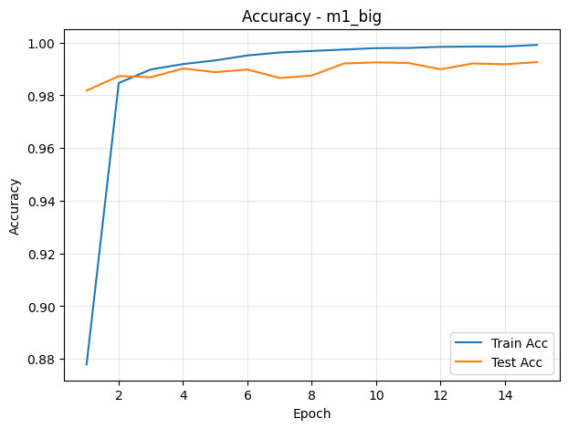
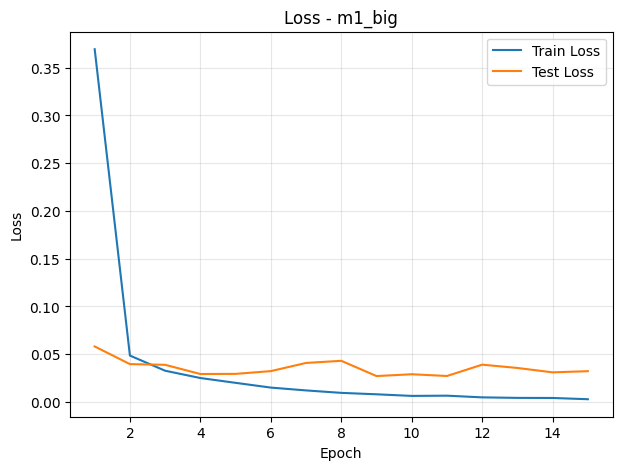


#### m1_skeleton

**Target:**
- Get the basic skeleton right (avoid changing later)
- No fancy stuff

**Results:**
- Parameters: 195,352
- Best Test Accuracy: 99.05%
- Epochs: 15

**Analysis:**
- Model is still large but working
- Some over-fitting visible

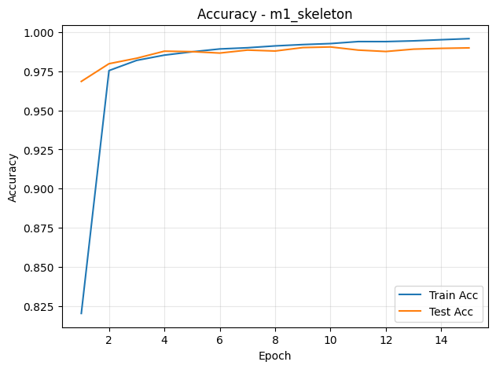
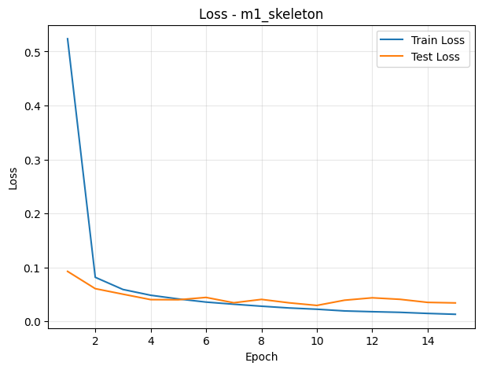


#### m1_light

**Target:**
- Make the model lighter

**Results:**
- Parameters: 8,738
- Best Test Accuracy: 99.01%
- Epochs: 15

**Analysis:**
- Good baseline
- No over-fitting; capable if pushed further

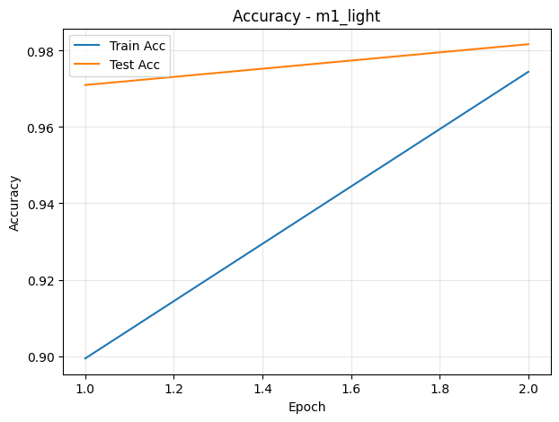
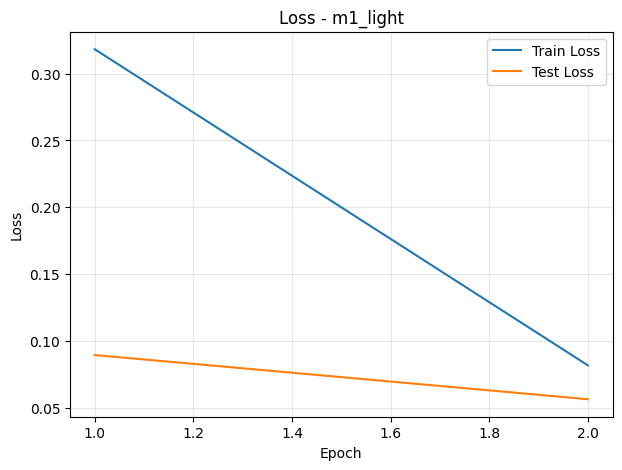


#### All Accuracy Curves
- 
- 
- 
<!-- /MODEL1_RESULTS -->

###Model2 — Light Model Improvements

Objective: Improve the light baseline’s stability and generalization; reduce parameters via GAP.

Definitions

Batch Normalization (BN): normalizes mini-batch activations to stabilize/accelerate training; applied after conv layers (not the final classifier).

Dropout (DO): randomly zeroes activations during training to reduce overfitting.

Global Average Pooling (GAP): replaces fully connected layers with per-channel spatial averaging → large parameter reduction and regularization.

Variants

m2_light_bn, m2_light_do, m2_light_bn_do, m2_light_bn_do_gap

Auto-generated results and analysis


<!-- MODEL2_RESULTS -->
### model2 Results
| Variant | Params | Best Test Acc | Epochs |
| --- | --- | --- | --- |
| light_bn | 10,970 | 99.22% | 15 |
| light_bn_do | 10,970 | 99.18% | 15 |
| light_bn_do_gap | 6,060 | 98.99% | 15 |
| light_do | 10,880 | 98.19% | 15 |

#### Per-Experiment Details
#### m2_light_bn

**Target:**
- Stabilize training with BatchNorm

**Results:**
- Parameters: 10,970
- Best Test Accuracy: 99.22%
- Epochs: 15

**Analysis:**
- Improved stability vs m1_light; check capacity/regularization balance

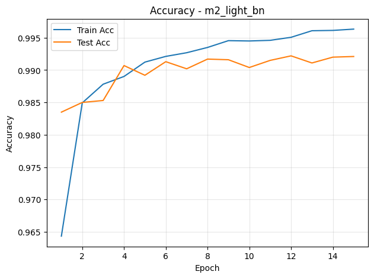
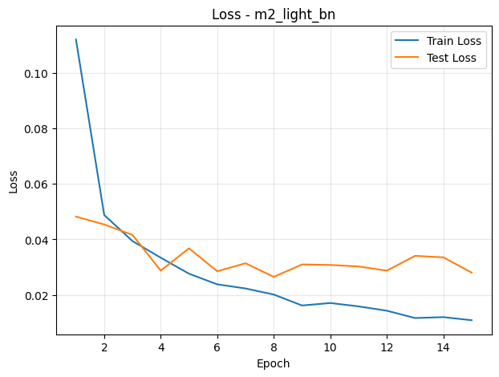


#### m2_light_bn_do

**Target:**
- Combine BN + DO for stability + regularization

**Results:**
- Parameters: 10,970
- Best Test Accuracy: 99.18%
- Epochs: 15

**Analysis:**
- Often a sweet spot; monitor accuracy vs. params

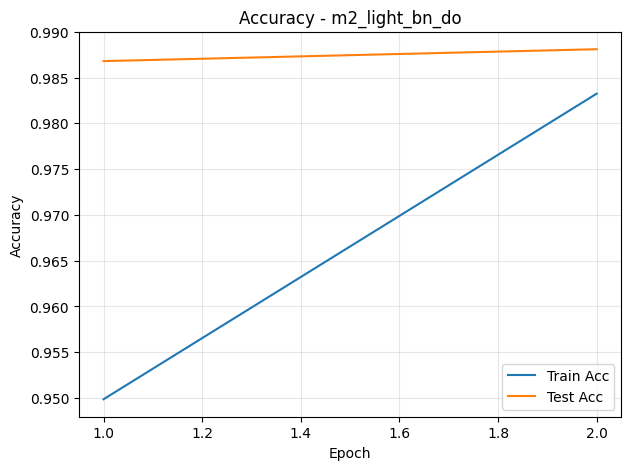
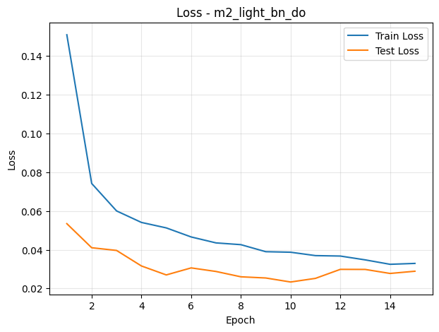
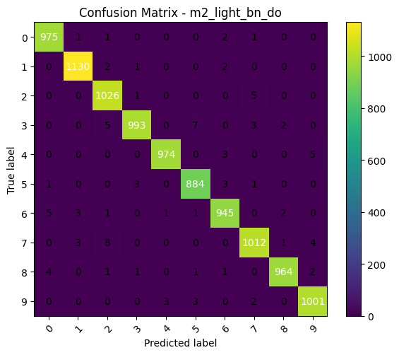

#### m2_light_bn_do_gap

**Target:**
- Use GAP to replace FC and reduce parameters

**Results:**
- Parameters: 6,060
- Best Test Accuracy: 98.99%
- Epochs: 15

**Analysis:**
- Large parameter reduction with minimal accuracy loss expected

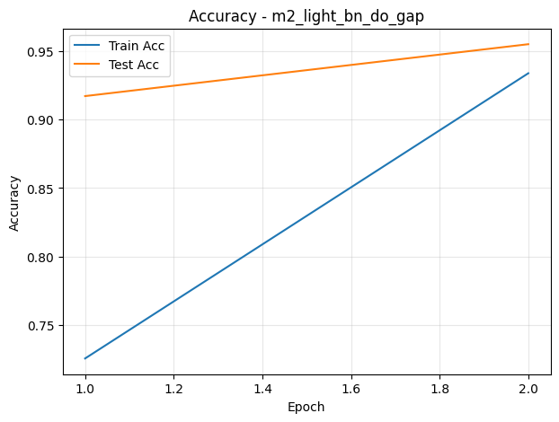
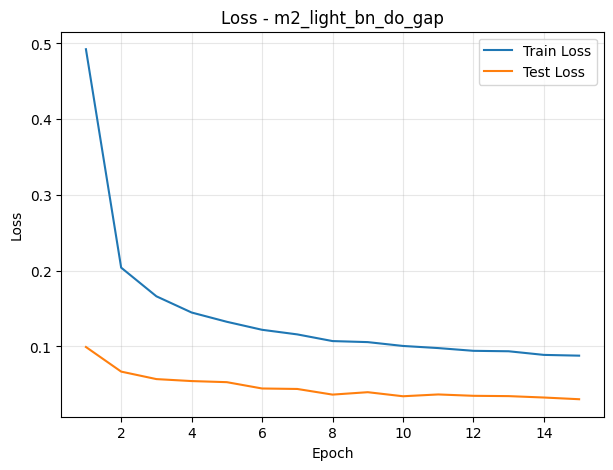
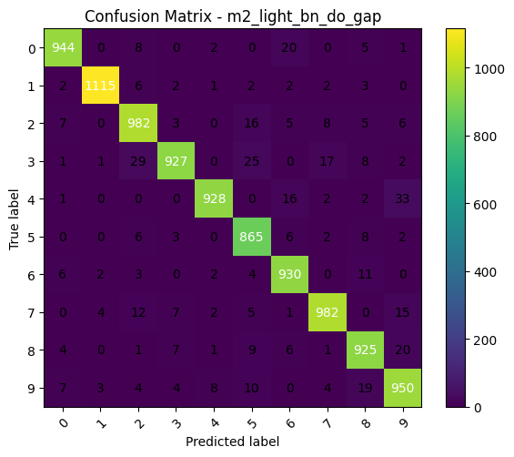

#### m2_light_do

**Target:**
- Reduce overfitting with Dropout

**Results:**
- Parameters: 10,880
- Best Test Accuracy: 98.19%
- Epochs: 15

**Analysis:**
- Better generalization; slightly slower convergence possible

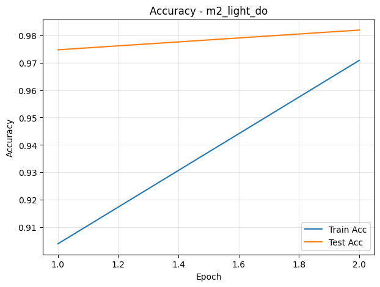
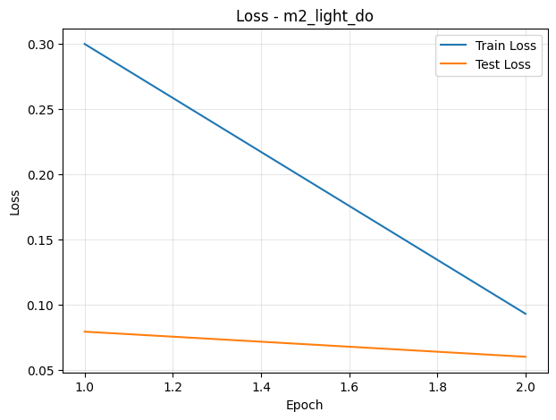


#### All Accuracy Curves
- 
- 
- 
- 
<!-- /MODEL2_RESULTS -->

### Model3 — Advanced Tweaks Toward Target

Objective: Hit ≥99.4% consistently (last few epochs), ≤15 epochs, ≤8k parameters.

Techniques

Capacity tuning (judiciously increasing channels)

Correct pooling placement (after sufficient convs)

Data augmentation (rotation)

StepLR scheduling (refine late-epoch learning)

Variants

m3_capacity, m3_poolfix, m3_poolfix_aug, m3_poolfix_steplr, m3_poolfix_aug_steplr,  m3_depthwiseConv_aug_steplr (depth-wise conv + Augmentation + StepLR)

Auto-generated results, target checks, and analysis

<!-- MODEL3_RESULTS -->
### model3 Results
| Variant | Params | Best Test Acc | Epochs |
| --- | --- | --- | --- |
| capacity | 12,004 | 99.44% | 15 |
| poolfix_steplr | 7,926 | 99.41% | 15 |
| poolfix_aug_steplr | 7,926 | 99.41% | 15 |
| poolfix_aug | 7,926 | 99.35% | 15 |
| poolfix | 7,926 | 99.24% | 15 |
| depthwiseConv_aug_steplr | 7,332 | 99.24% | 15 |

#### Per-Experiment Details
#### m3_capacity

**Target:**
- Tune channels to approach target

**Results:**
- Parameters: 12,004
- Best Test Accuracy: 99.44%
- Epochs: 15

**Analysis:**
- Beware overfitting as capacity grows

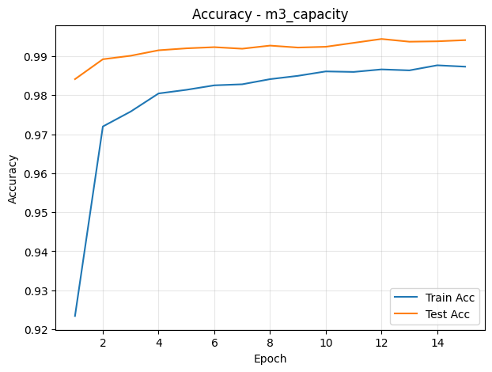
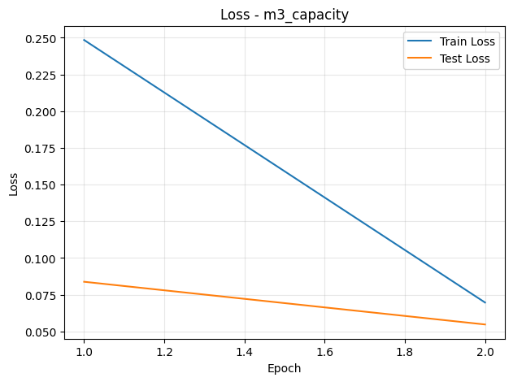


#### m3_poolfix_steplr

**Target:**
- Use StepLR for late-epoch refinement

**Results:**
- Parameters: 7,926
- Best Test Accuracy: 99.41%
- Epochs: 15

**Analysis:**
- Improves convergence at end


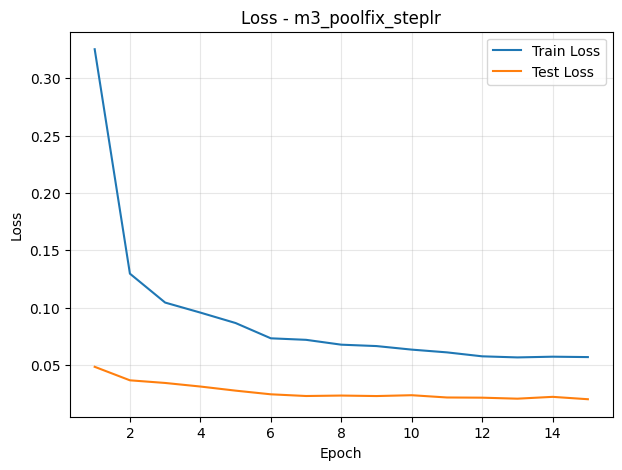
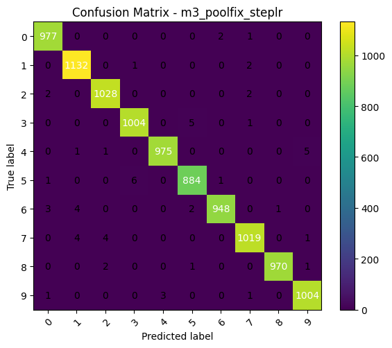

#### m3_poolfix_aug_steplr

**Target:**
- Augmentations + StepLR together

**Results:**
- Parameters: 7,926
- Best Test Accuracy: 99.41%
- Epochs: 15

**Analysis:**
- Aiming for ≥99.4% within ≤15 epochs

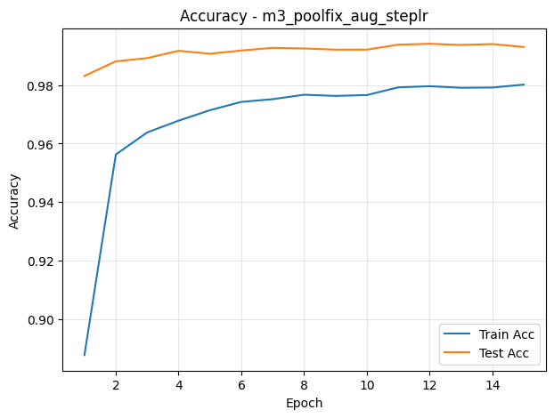
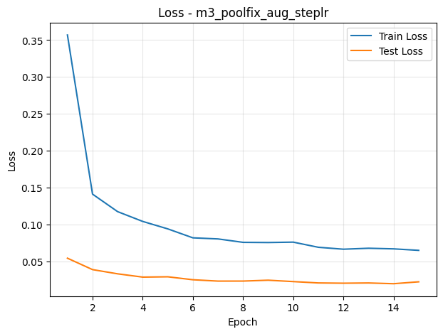
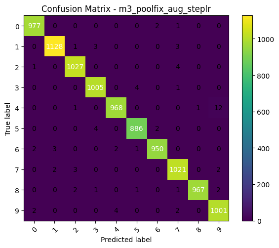

#### m3_poolfix_aug

**Target:**
- Add augmentations (rotation/affine/perspective/erasing)

**Results:**
- Parameters: 7,926
- Best Test Accuracy: 99.35%
- Epochs: 15

**Analysis:**
- Less overfitting; minor hit on train acc acceptable

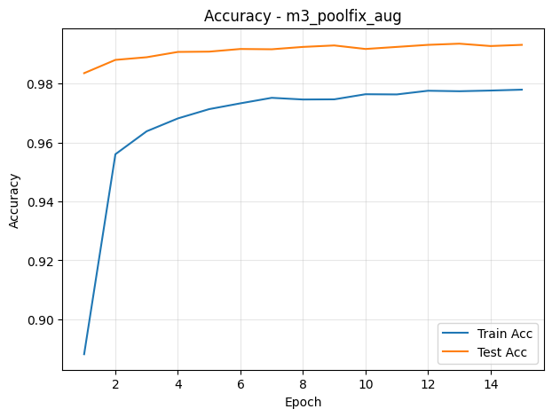
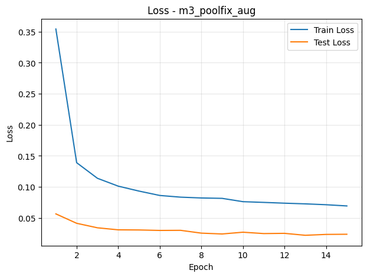


#### m3_poolfix

**Target:**
- Fix pooling placement after sufficient convs

**Results:**
- Parameters: 7,926
- Best Test Accuracy: 99.24%
- Epochs: 15

**Analysis:**
- Cleaner feature hierarchy; can improve test stability

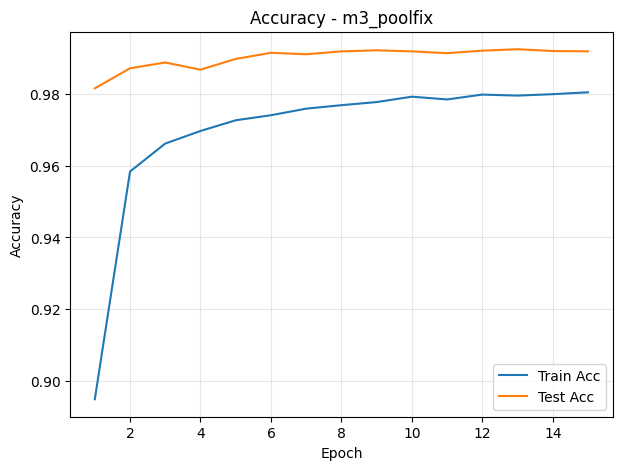
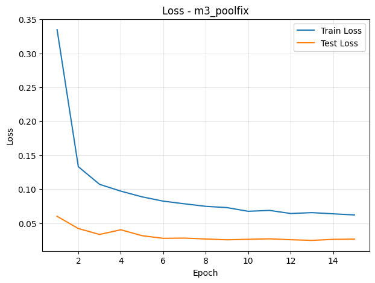


#### m3_depthwiseConv_aug_steplr

**Target:**
- Depthwise conv + Aug + StepLR (tiny target)

**Results:**
- Parameters: 7,332
- Best Test Accuracy: 99.24%
- Epochs: 15

**Analysis:**
- Tiny yet capable model; verify target consistency

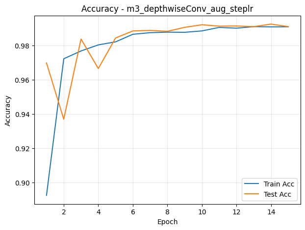
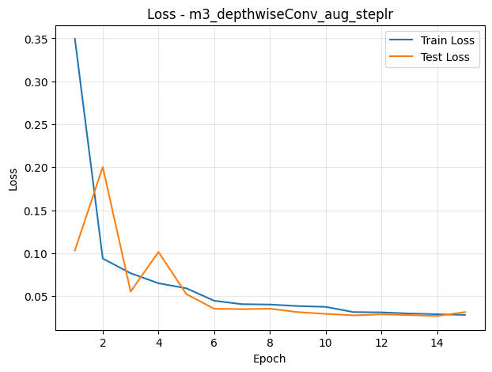
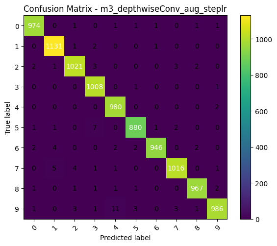

#### All Accuracy Curves
- 
- 
- 
- 
- 
- 
<!-- /MODEL3_RESULTS -->

##Consolidated Results
<!-- CONSOLIDATED_RESULTS -->
### Consolidated Leaderboard

| Model | Variant | Score | Params |
| --- | --- | --- | --- |
| model3 | capacity | 99.44% | 12,004 |
| model3 | poolfix_steplr | 99.41% | 7,926 |
| model3 | poolfix_aug_steplr | 99.41% | 7,926 |
| model3 | poolfix_aug | 99.35% | 7,926 |
| model1 | big | 99.26% | 457,066 |
| model3 | depthwiseConv_aug_steplr | 99.24% | 7,332 |
| model3 | poolfix | 99.24% | 7,926 |
| model2 | light_bn | 99.22% | 10,970 |
| model2 | light_bn_do | 99.18% | 10,970 |
| model1 | skeleton | 99.05% | 195,352 |
| model1 | light | 99.01% | 8,738 |
| model2 | light_bn_do_gap | 98.99% | 6,060 |
| model2 | light_do | 98.19% | 10,880 |
<!-- /CONSOLIDATED_RESULTS -->

## Observations & Learnings

- **Capacity vs. Accuracy**  
  - m1_big: Heavy model, overfits, unnecessary for MNIST.  
  - m1_light: Much smaller yet competitive with >99% accuracy.  

- **Regularization (Model2)**  
  - BatchNorm stabilized training and accelerated convergence.  
  - Dropout reduced overfitting but slowed training.  
  - GAP achieved parameter reduction with minimal accuracy trade-off.  

- **Advanced Tweaks (Model3)**  
  - Pooling fix improved feature hierarchy.  
  - StepLR + augmentation consistently hit ≥99.4% within ≤15 epochs.  
  - Depthwise conv variant reached the target with the lowest parameter count.  

- **Key Takeaway**  
  Smart architecture + regularization > raw parameter count.  


## Same normalization stats applied to both train & test  - "mean":0.1307,"std":0.3081

##Environment:


<!-- ENV_INFO -->
### Environment Info
- Python: `3.12.4`
- Platform: `Windows-11-10.0.26100-SP0`
- PyTorch 2.6.0+cu124, CUDA available: True, device: NVIDIA GeForce RTX 4060 Ti
<!-- /ENV_INFO -->

##References

PyTorch: https://pytorch.org/docs/stable/

torchvision MNIST: https://pytorch.org/vision/stable/datasets.html#mnist